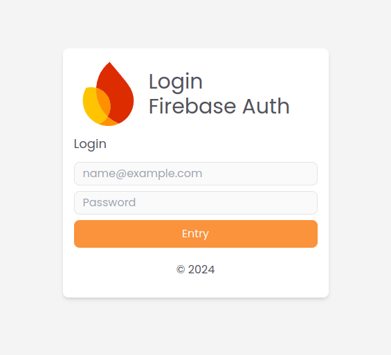

# Login Firebase Auth JS

<p align="center">

</p>

<p align="center">
    
</p>

## 🚀 Project Technologies
- **[Astro](https://astro.build/)**: Astro é um framework moderno para construir sites rápidos com componentes.
- **[Firebase Authentication](https://firebase.google.com/docs/auth)**: Firebase Auth fornece back-end services, SDKs fáceis de usar e bibliotecas UI para autenticar usuários na aplicação.
- **[Tailwind CSS](https://tailwindcss.com/)**: Tailwind CSS é um framework CSS utilitário para criar rapidamente designs personalizados.
- **JavaScript**: Utilizado para lógica de autenticação e interatividade na página.

## 🚀 Project Structure

```text
/
├── public/
│   └── favicon.svg
├── src/
│   ├── components/
│   │   └── Card.astro
│   ├── layouts/
│   │   └── Layout.astro
│   └── pages/
│       └── index.astro
└── package.json
```

Any static assets, like images, can be placed in the `public/` directory.

## 🧞 Commands

All commands are run from the root of the project, from a terminal:

| Command                   | Action                                           |
| :------------------------ | :----------------------------------------------- |
| `npm install`             | Installs dependencies                            |
| `npm run dev`             | Starts local dev server at `localhost:4321`      |
| `npm run build`           | Build your production site to `./dist/`          |
| `npm run preview`         | Preview your build locally, before deploying     |
| `npm run astro ...`       | Run CLI commands like `astro add`, `astro check` |
| `npm run astro -- --help` | Get help using the Astro CLI                     |

## 👀 Want to learn more?

Feel free to check [our documentation](https://docs.astro.build) or jump into our [Discord server](https://astro.build/chat).
